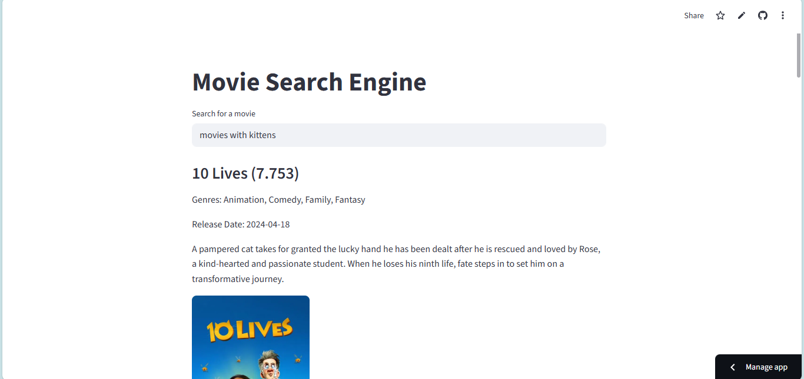

<h1>Movie Search Engine</h1> 
An interactive movie search engine that helps users discover movies from 2000 to 2025 based on the search query. Built with Python and deployed on Streamlit Cloud for seamless access.

<h2>Live Demo</h2>
Try the app here: <a href="https://movies-search-engine-nhm6kbag7wtb8ljrdboe7p.streamlit.app/">Streamlit App Link</a>

<h2>Demo GIF</h2>

<h2>Images</h2>

  
  

<h2>Features</h2>
<ul>
 <li>Search for movies by title, genre, or keyword</li>
 <li>Retrieves the most relevant results from a dataset of around 3000 movies</li>
 <li>Fast similarity search using vector embeddings</li>
 <li>Simple and intuitive interface with Streamlit</li>
</ul>

<h2>Technologies Used</h2>
<ul>
 <li>Python - Core language for data processing and search logic</li>
 <li>Streamlit - For interactive UI and deployment</li>
 <li>FAISS / Vector Databases - For efficient similarity search</li>
 <li>JSON - For managing and processing the dataset</li>
 <li>Text Embedding Model - For better search relevance</li>
</ul>

<h2>Installation (Run Locally)</h2>
<pre>
 <code>
   #Clone the repository
   git clone https://github.com/Munfa/movies-search-engine.git
   cd movies-search-engine
   
   #Install dependencies
   pip install -r requirements.txt
   
   #Run the application
   Streamlit run app.py
 </code>
</pre>

<h2>Dataset</h2>
<ul>
 <li>Collected movies from <a href="https://developer.themoviedb.org/docs/getting-started">TMDB API</a></li>
 <li>Movies from 2000 to 2025 stored in movies.json</li>
 <li>Includes Title, Genres, Release Date, Overview, and Poster Link</li>
 </ul>

<h2>How it works</h2>
<ol>
 <li>Enter a search query in the Streamlit App</li>
 <li>The query is converted into vector embeddings</li>
 <li>FAISS finds the closest matches from the database</li>
 <li>The top results are displayed with details such as Title, Genres, Release Date, Overview, and Poster</li>
</ol>
 
<h2>Future Enhancements</h2>
<ul>
 <li>Add filtering options (genre, year, rating)</li>
 <li>Use advanced NLP models for improved search accuracy</li>
</ul>
 
<h2>License</h2>
This project is licensed under the MIT License.

